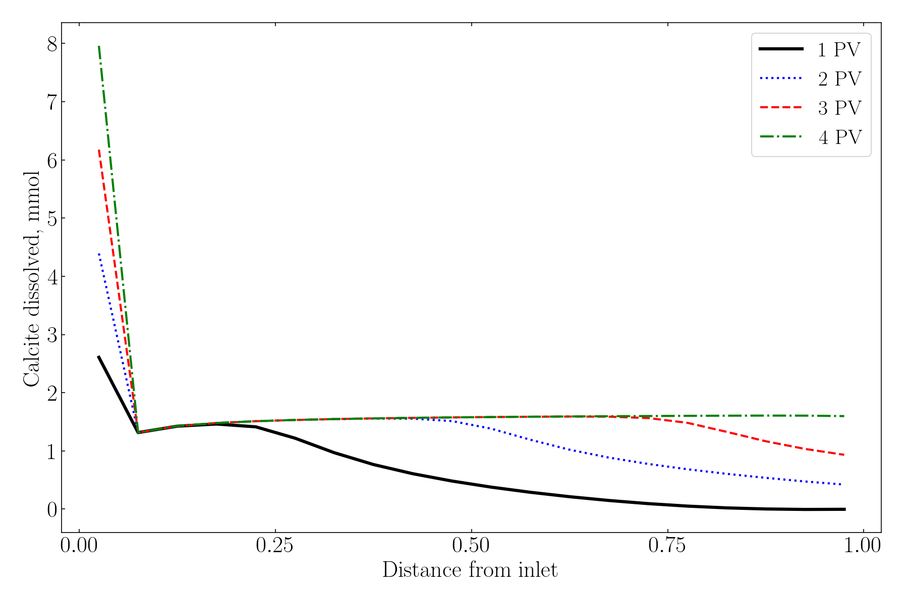
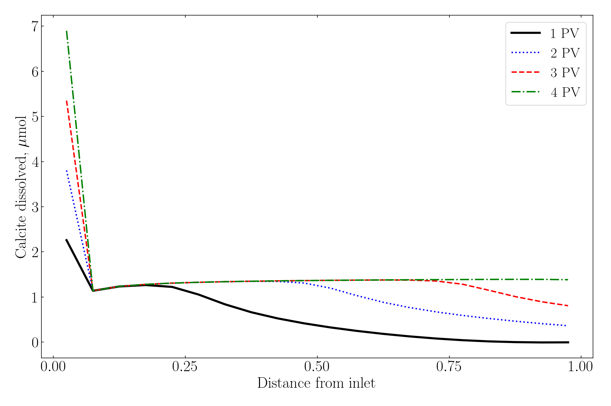

This note compares a typical PHREEQC transport input and a porosity-aware input.

## Model dimensions inferred from the input

- Number of cells: 20
- Cell length: 0.0038 m (3.8 mm)
- Total length: 0.076 m (7.6 cm)
- Porosity: 0.2
- Porosity-aware pore water per cell: 0.000866469789 kg (~0.866 mL)
- Total pore water in the domain: ~0.01733 L

Porosity is represented through explicit `-water` and matching inventory scaling (minerals/exchanger), instead of relying on PHREEQC default water mass.

## Typical setup (easy to run, wrong for porosity-driven rock-volume effects)

```text
SELECTED_OUTPUT 1
  -reset true
  -molalities Ca+2 Na+ Cl- K+ Mg+2 NaZ CaZ2
  -activities Ca+2 Na+ Cl- K+ Mg+2 NaZ CaZ2

  -saturation_indices Calcite
  -equilibrium_phases Calcite

EXCHANGE_MASTER_SPECIES
  Z Z-

EXCHANGE_SPECIES
# note, the exchange reactions do not include all of those in https://10.1016/j.fuel.2022.125350
# only major effects are considered, which is enough to replicated the graphs with great accuracy
  Z- = Z- ; log_k 0

  Z- + Na+ = NaZ
  log_k 0

  2Z- + Ca+2 = CaZ2
  log_k 0.77


SOLUTION 1000 Initial
units ppm
pH 7
Na 10822
Ca 402
K 90
Mg 49
Cl 17924 charge

EQUILIBRIUM_PHASES 1000
  Calcite 0 1

SAVE SOLUTION 1000
COPY SOLUTION 1000 1-20
END

SOLUTION 0 Injection
units ppm
pH 7
Na 373
Ca 14
K 3.1
Mg 1.7
Cl 607.7 charge

EQUILIBRIUM_PHASES 0
CO2(g) -3.5 10
END

EQUILIBRIUM_PHASES 1-20
  Calcite 0 10

EXCHANGE 1-20
  -equil 1000
  Z 9e-3

TRANSPORT
  -initial_time 1000
  -time_step 30.0
  -boundary_conditions flux flux
  -dispersivities 20*1e-06
  -correct_disp true
  -diffusion_coefficient 0
  -cells 20
  -shifts 80
  -length 20*0.0038
  -punch_cells 1-20
  -punch_frequency 1
  -print_cells 20
END
```

## Porosity-aware setup (recommended)

```text
SELECTED_OUTPUT 1
  -reset true
  -molalities Ca+2 Na+ Cl- K+ Mg+2 NaZ CaZ2
  -activities Ca+2 Na+ Cl- K+ Mg+2 NaZ CaZ2

  -saturation_indices Calcite
  -equilibrium_phases Calcite

EXCHANGE_MASTER_SPECIES
  Z Z-

EXCHANGE_SPECIES
  Z- = Z- ; log_k 0

  Z- + Na+ = NaZ
  log_k 0

  2Z- + Ca+2 = CaZ2
  log_k 0.77

SOLUTION 1000 Initial
  -water 0.000866469789256721 kg
units ppm
pH 7
Na 10822
Ca 402
K 90
Mg 49
Cl 17924 charge

EQUILIBRIUM_PHASES 1000
  Calcite 0 1

SAVE SOLUTION 1000
COPY SOLUTION 1000 1-20
END

SOLUTION 0 Injection
  -water 0.000866469789256721 kg
units ppm
pH 7
Na 373
Ca 14
K 3.1
Mg 1.7
Cl 607.7 charge

EQUILIBRIUM_PHASES 0
CO2(g) -3.5 10
END

EQUILIBRIUM_PHASES 1-20
  Calcite 0 0.09184579766121242

EXCHANGE 1-20
  -equil 1000
  Z 7.798228103310489e-06

TRANSPORT
  -initial_time 1000
  -time_step 30.0
  -boundary_conditions flux flux
  -dispersivities 20*1e-06
  -correct_disp true
  -diffusion_coefficient 0
  -cells 20
  -shifts 80
  -length 20*0.0038
  -punch_cells 1-20
  -punch_frequency 1
  -print_cells 20
END
```
In most cases the first setup is applicable, but fails in certain use cases. The first setup can reproduce published curves (e.g., [Fuel 2022 study](https://doi.org/10.1016/j.fuel.2022.125350)), but it mis-scales porosity-sensitive mineral/exchanger effects resulting in vast overestimation of mineral dissolution, contradicting all experimental observations. The second setup is the corrected version. Essentially, graphs look identical, and the only difference is the scale of the y-axis, which constitutes a factor of 1000.

## Figures (placeholders)

{#fig-no-porosity}

{#fig-porosity}
